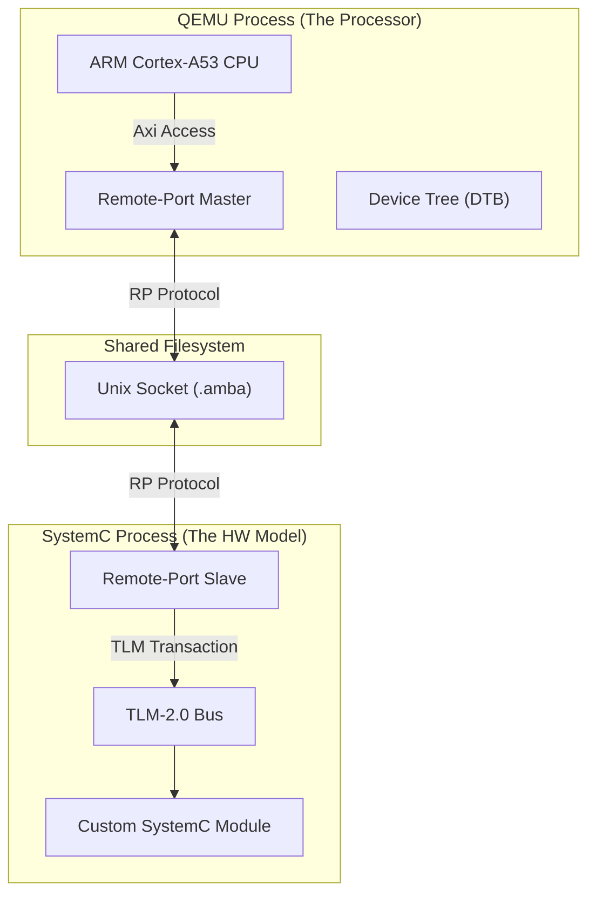

# Technical Deep Dive: Xilinx Co-Simulation Architecture

This document explains the underlying technology, logic, and component relationships that enable SystemC/TLM-2.0 models to interact with the Xilinx QEMU fork.

## 1. Core Technologies

### SystemC & TLM-2.0
- **SystemC**: A C++ class library used for system-level modeling. It provides an event-driven simulation kernel.
- **TLM-2.0 (Transaction-Level Modeling)**: A standard for high-performance modeling of memory-mapped buses and hardware blocks. It uses "transactions" (data payloads) instead of pin-toggle signaling to speed up simulation.

### QEMU (Xilinx Fork)
- QEMU is a fast processor emulator. The **Xilinx Fork** adds the **Remote-Port (RP)** framework, which allows QEMU to externalize its bus transactions (Axi, APB, etc.) to an external simulator like SystemC.

---

## 2. The Remote-Port (RP) Protocol

Remote-Port is the "glue" that connects the two simulators.

### How it Works (Linux Logic)
1. **Unix Domain Sockets**: The protocol uses standard Linux IPC (Inter-Process Communication). QEMU creates a socket file (e.g., in `./qemu-tmp/`).
2. **The "Wire"**: One simulator acts as a server (listening), and the other acts as a client (connecting). In our setup, QEMU listens and SystemC connects.
3. **Packetized Transactions**: When QEMU's CPU executes a `load` instruction at a memory address owned by SystemC, it wraps that request into an RP packet and sends it over the socket.
4. **Synchronization**: Both simulators must agree on the simulation time. RP includes "Sync" packets to ensure SystemC doesn't run too far ahead or behind QEMU.

---

## 3. Component Relationships



---

## 4. Why Device Trees Matter

Standard QEMU uses a DTB to know what hardware exists. For co-simulation, the DTB must define a **Remote-Port instance**.

- **The Problem**: In ZynqMP, the DTB often includes a PMU (Platform Management Unit). QEMU refuses to boot until *both* the APU (Processors) and PMU connections are established.
- **The Fix**: By "stripping" the PMU nodes from the DTB, we tell QEMU that the PMU is "internal" or "tied-off," allowing the APU co-simulation to proceed independently.

---

## 5. Library Roles

- **`libsystemctlm-soc`**: This is the heart of the C++ side. It provides the [xilinx_zynqmp](file://$PROJ_ROOT/libsystemctlm-soc/soc/xilinx/zynqmp/xilinx-zynqmp.h#41-174) object which contains the Remote-Port client implementation.
- **`systemctlm-cosim-demo`**: High-level examples that instantiate the SoC models and connect them to user-defined SystemC blocks (like the DMA or memory blocks in our demo).
- **`systemc` (The Lib)**: Provides the timing and event kernel that manages the flow of transactions.

---

## 6. Minute Details: The "Sync Quantum"

The `-sync-quantum 10000` parameter is critical:
- It defines how many picoseconds (or nanoseconds) the simulators can drift apart before they MUST synchronize.
- **Smaller value (10,000)**: Very accurate hardware behavior, but slow simulation (lots of socket traffic).
- **Larger value (1,000,000)**: Faster simulation, but less accurate timing for high-speed interrupts.

---

## 7. Code Breakdown: How it all Works

### The Software: [app.c](file://$PROJ_ROOT/systemctlm-cosim-demo/app.c)
This usage model explains what happens when you run `app.elf`.

1.  **Definitions**: `#define DEBUG_DEV_ADDR 0xA0020000` tells the code where to send data. 
    *   *Note*: This matches the address mapped in [zynqmp_demo.cc](file://$PROJ_ROOT/systemctlm-cosim-demo/zynqmp_demo.cc).
2.  **Pointer Magic**: `volatile uint32_t *ptr = ...` bypasses the CPU cache. If we didn't use `volatile`, the CPU might "optimize" our write by not actually sending it to the hardware because it thinks no one is reading it efficiently.
3.  **The Loop**:
    ```c
    while(1) {
       *ptr = 0xAAAAAAAA; // Creates a HIGH state on the bus
       delay();           // Holds the state so we can see it in GTKWave
       *ptr = 0x55555555; // Creates a LOW state
    }
    ```

### The Hardware: [zynqmp_demo.cc](file://$PROJ_ROOT/systemctlm-cosim-demo/zynqmp_demo.cc)
This C++ file defines the "Virtual Motherboard".

1.  **`xilinx_zynqmp zynq`**: This object represents the ZynqMP chip itself (instantiated from `libsystemctlm-soc`).
2.  **`bus.memmap(...)`**: These lines are the routing table. They tell the system: *"If an address is between `X` and `Y`, send the transaction to Device Z."*
    *   Example: `bus.memmap(0xa0020000ULL... tlm2apb_tmr)` routes traffic to the APB Bridge.
3.  **`tlm2apb_bridge`**: This component converts the abstract TLM packet (Address + Data) into individual wire signals (`psel`, `penable`, `pwdata`, `paddr`).
    *   **This is why we see waveforms!** Without this bridge, the transaction would happen instantaneously as a function call, leaving no trace in a VCD file.

---

## 8. Hardware Address Map for Waveforms

When writing software, use this map to target specific simulation components.

| Component Name | Physical Address (Base) | What it does | Visible in Waveforms? |
| :--- | :--- | :--- | :--- |
| **DDR RAM** | `0x00000000` | Main memory for code execution. | **No** (Internal qemu optimization) |
| **Debug Device** | `0xA0000000` | Prints data to the terminal. | **No** (It is a pure C++ model with no wires) |
| **AXI DMA 0** | `0xA0010000` | Direct Memory Access Controller. | **Yes** (If you observe the `dma` signals) |
| **APB Timer** | `0xA0020000` | A simple timer peripheral on the APB bus. | **Yes** (Look for `apbtimer_pwdata`, `psel`) |
| **AXI DMA 1** | `0xA0010100` | Second DMA controller. | **Yes** |

---

## 9. Visual Hierarchy: PS vs PL in GTKWave

In your viewer, the hierarchy maps directly to the ZynqMP architecture:

### 🟢 The PS (Processing System)
*   **Folder Name**: [zynq](file://$PROJ_ROOT/libsystemctlm-soc/soc/xilinx/zynqmp/xilinx-zynqmp.h#41-174)
*   **What it is**: This represents the Hard Silicon (ARM CPUs + Memory Controller).
*   **Where it runs**: This block is actually purely virtual! It is a proxy for the QEMU process.
*   **Signals**: You typically won't see internal CPU signals here (like registers) because QEMU hides them. You only see the **Ports** exiting the PS.

### 🔵 The PL (Programmable Logic)
*   **Folder Names**: `demodma`, `tlm2apb-tmr-bridge`, [debug](file://$PROJ_ROOT/systemctlm-cosim-demo/debugdev.cc#40-46)
*   **What they are**: These are the "FPGA" logic blocks.
    *   **`demodma`**: A custom DMA engine written in SystemC.
    *   **`tlm2apb-bridge`**: Logic that converts the AXI bus to APB bus.
    *   **[debug](file://$PROJ_ROOT/systemctlm-cosim-demo/debugdev.cc#40-46)**: The custom "printer" device.
*   **Where they run**: These are executed natively by the SystemC kernel.
*   **Signals**: You can see EVERYTHING here (wires, state machines, registers) because they are fully simulated models.

---

## 10. The Signal Journey: From C Code to Wires

You might wonder: *"How do I see wires in GTKWave if QEMU is just a software process?"*

Here is the step-by-step path of a single write instruction:

1.  **Instruction (QEMU)**: Your C code executes `str x0, [0xA0020000]`.
2.  **Redirect (QEMU)**: QEMU's memory system sees this address belongs to the **Remote-Port**. It freezes the CPU and sends a packet over the Unix Socket.
3.  **Reception (SystemC)**: The `libsystemctlm-soc` library receives the packet and creates a **TLM Generic Payload**. This is "wire-less" (just a C++ object).
4.  **The Bridge (The Mediator)**: The payload hits the `tlm2apb_bridge`. This is where the "magic" happens. The bridge logic says: *"I need to talk to a pin-level device."*
5.  **Pin Toggling (SystemC Wires)**: The bridge translates the TLM payload into **`sc_signal<bool>`** toggles. It sets `psel` = 1, `pwrite` = 1, and puts data on the `pwdata` wire.
6.  **The DUT (Verilated RTL)**: In this demo, the `apb_timer` is actually **Verilog RTL** that has been "Verilated" (converted to C++). It sees these wires toggle and updates its hardware registers.
7.  **GTKWave (VCD)**: SystemC records every change to those `sc_signal` wires into `trace.vcd`.

---

## 11. The PMU Secret: Why do we strip it?

Why did the co-simulation hang before we stripped the PMU ports?

*   **The Multi-Processor Design**: The ZynqMP (ZCU102) has a separate MicroBlaze processor called the **PMU** (Platform Management Unit) for power management.
*   **The Default DTB**: Xilinx's co-simulation DTB expects **two separate co-simulations** to connect to QEMU:
    1.  One for the **APU** (The Cortex-A53s running our code).
    2.  One for the **PMU** (Another SystemC process we aren't running).
*   **The Hang**: If QEMU sees a node like `pmu@0 { compatible = "remote-port"; }` in the DTB, it assumes it MUST wait for that co-simulator to connect to the socket before it starts.
*   **The Fix**: By "Stripping" these nodes, we trick QEMU into thinking there is no external PMU, so it proceeds immediately to run our APU code.

---

## 12. The Simpler Path: Zynq-7000 (32-bit)

While ZynqMP is the industry standard for high-performance 64-bit designs, the **Zynq-7000** (ZC702/ZedBoard) is the "Golden Path" for learning:
*   **No PMU**: It lacks the separate PMU processor that causes the "QEMU Hang" issue.
*   **Lean Demo**: The `zynq_demo.cc` code is minimal, focusing purely on a single AXI master and a simple interconnect.
*   **32-bit Architecture**: Standard `arm-none-eabi` or `arm-linux-gnueabihf` toolchains work without the complexity of 64-bit startup code.

---

## 13. The "Stuck" Mystery: Why does QEMU wait?

You asked why QEMU waits for the PMU node but not others.

*   **The "Machine" Logic**: In the Xilinx QEMU fork, the machine type `-M arm-generic-fdt` is highly intelligent. While a standard QEMU machine just loads the DTB and moves on, the **Xilinx Co-Sim Machine** parses every node with `compatible = "remote-port"`.
*   **The Blocking Handshake**: For every such node, QEMU creates a "Synchronization Barrier." It will NOT release the CPU from reset until a `HELLO` packet is received over the Unix socket for **every** defined ID.
*   **Why PMU?**: The ZynqMP DTB defines `pmu@0` as a `remote-port`. Since we only launch **one** SystemC process (for the PL), the PMU ID remains "un-satisfied." QEMU waits forever for that second connection.

---

## 14. How does QEMU know the Address? (DTB Mapping)

How does a write to `0xA0020000` actually leave QEMU? It's a chain of 3 links:

1.  **The Range (DTB)**: 
    Inside the [zcu102-arm.cosim.dtb](file://$PROJ_ROOT/qemu-devicetrees/LATEST/LQSPI_XIP/zcu102-arm.cosim.dtb), there is a node `hpm0_fpd@a0000000`. 
    - It defines a `reg` range of `0xA0000000` to `0xB0000000`.
    - It has a property `remote-ports = <0x63 0x09>`. (0x63 = `cosim@0` socket, 0x09 = **Port ID 9**).
2.  **The Connection (SystemC)**: 
    When we run `./zynqmp_demo`, it connects to the socket. Inside [xilinx-zynqmp.cc](file://$PROJ_ROOT/libsystemctlm-soc/soc/xilinx/zynqmp/xilinx-zynqmp.cc), the code runs:
    ```cpp
    register_dev(9, &rp_axi_hpm0_fpd); // Links Port ID 9 to this TLM object
    ```
3.  **The Execution**:
    - **Software**: Writes to `0xA0020000`.
    - **QEMU**: "I see this is in the `hpm0` range. I'll send it to Socket `cosim@0` on Port `9`."
    - **SystemC**: "I just got a packet for Port `9`. I'll trigger a transaction on my `rp_axi_hpm0_fpd` socket."
    - **Bus**: The transaction travels from `zynq.s_axi_hpm_fpd[0]` -> `bus` -> `tlm2apb_tmr` -> **Wires**.

This is why co-simulation is so powerful: the Device Tree acts as the **Hardware Map**, and the SystemC code acts as the **Hardware Implementation**.

---

## 15. The Lifecycle of a Remote-Port Socket

You asked: *"Who creates the sockets and how does the connection trigger the release?"*

1.  **Discovery (QEMU Boot)**:
    When you run QEMU with `-dtb`, the Xilinx-specific machine driver (`arm-generic-fdt`) scans the Device Tree. It is looking for any node with `compatible = "remote-port"`.
2.  **Creation (The Socket)**:
    For every such node (like `cosim@0`), QEMU creates a internal **Remote-Port Slave** object. This object is responsible for creating a Unix Domain Socket file in the directory you specified with `-machine-path`.
    *   *Path logic*: The filename is derived from the `chrdev-id` (e.g., `pl-rp`) and the node path.
3.  **The Wait Barrier (Handshake)**:
    This is the "Stuck" part. QEMU enters a **Handshake Phase**. It refuses to release the CPU from reset until it receives a specialized `HELLO` packet on **every** Remote-Port socket it created.
4.  **The Trigger (SystemC)**:
    When you run `./zynqmp_demo`, the `remoteport_tlm` library connects to that socket and immediately sends the `HELLO` packet.
5.  **The Release**:
    QEMU receives the packet, realizes the co-simulator is "Alive," and drops the wait barrier. If you have multiple Remote-Ports (like APU and PMU), it waits for **both** before starting the simulation.

## 16. Technical Link: `compatible` to Sockets

The `compatible = "remote-port"` string isn't just a label—it is a **Binding Key**.
*   **In QEMU**: It tells the FDT parser to instantiate a `remote-port` bridge instead of a standard emulated device.
*   **In DTS**: It identifies the "Socket Header." All other nodes (like `hpm0_fpd`) then use the `remote-ports = <&cosim_rp_0 9>` property to say: *"I am a memory range that feeds into Port ID 9 of that specific socket."*

This architecture allows Xilinx to mix-and-match: you can have some hardware emulated inside QEMU and some externalized to SystemC, all controlled by the same Hardware Map (DTB).

---

## 17. The "Lock-Step" Mechanism: What is `sync-quantum`?

You asked for a further explanation of "Lock-Step." 

In a co-simulation, you have two independent programs running: **QEMU** (emulating the CPU) and **SystemC** (simulating hardware). Each has its own clock.
- If QEMU runs "too fast," it might send a command to the hardware before the hardware is ready.
- If SystemC runs "too fast," it might miss an interrupt signal from the CPU.

### The Synchronization Handshake
The `sync-quantum` (e.g., 10,000 ps) acts as a **Temporal Boundary**. 
1.  **The Run**: QEMU runs its ARM instructions for exactly 10,000 picoseconds.
2.  **The Pause**: Once it hits that limit, QEMU sends a `SYNC` packet over the socket to SystemC.
3.  **The Alignment**: SystemC receives the packet, catches up its own simulation to that same time, and sends a `SYNC_ACK` back.
4.  **The Resume**: Only after this handshake is complete does QEMU continue for the next 10,000 ps.

> [!NOTE]
> **Why 10,000?**: A smaller number means more handshakes, making the simulation **slow but perfectly accurate**. A larger number is **fast but "jittery,"** which might cause high-speed hardware events to be processed slightly out of order.

---

## 18. Device Tree Merging & References

You asked: *"How do we add the nodes and where are the references?"*

Xilinx uses a **Modular Device Tree** approach. Instead of one giant file, they break the hardware into fragments:
1.  **Base Board Source (`.dts`)**: Definitions for CPU, RAM, and internal peripherals.
2.  **Remote-Port Overlays (`.dtsi`)**: Standard templates provided by Xilinx (found in `$PROJ_ROOT/qemu-devicetrees/`) that define the `remote-port` compatible nodes.
    - *Example*: `zynqmp-pl-remoteport.dtsi` is the standard reference for ZynqMP Programmable Logic ports.

### The Merging Process
When we "merge" a device tree for co-simulation, we are following one of two paths:

#### Path A: The Developer Way (Standard)
We create a new top-level `.dts` file that uses `#include` to pull in both the board and the remote-port fragments:
```dts
#include "zcu102-arm.dts"
#include "zynqmp-pl-remoteport.dtsi"
```
Then we compile it with `dtc -I dts -O dtb -o board.cosim.dtb`.

#### Path B: The "Hacker" Way (Our Guide)
Since beginners often don't have the full build tree set up, we use **Decompilation**:
1.  Take an existing `.dtb`.
2.  Convert it to text (`dtc -I dtb -O dts`).
3.  **Manually Paste** the Remote-Port nodes (using Xilinx's `.dtsi` files as the reference for values).
4.  Convert it back to binary.

**Where are the References?**: 
All "Canonical" Remote-Port structures are stored in the [qemu-devicetrees](file:///home/testuser/Qemu/qemu-devicetrees/) repository. Files ending in `-remoteport.dtsi` are your "dictionaries" for how to format nodes for HPM ports, Interconnects, and Interrupts.
