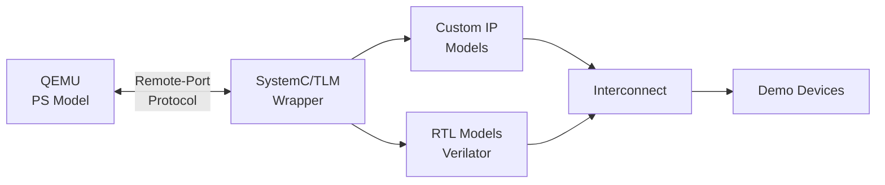

# Xilinx QEMU Co-Simulation Setup

This implementation plan outlines the steps to set up Xilinx QEMU co-simulation environment following the official Xilinx documentation. This will enable co-simulation between QEMU (modeling the PS - Processing System) and SystemC/TLM-2.0 models (modeling custom IP in the PL - Programmable Logic).

## Overview

The co-simulation framework allows:
- **QEMU** to model hardened Processing System (PS) of Zynq/ZynqMP/Versal devices
- **SystemC/TLM-2.0** or **RTL (Verilog)** models to represent custom IP in Programmable Logic
- Communication via **Remote-Port** protocol using sockets and shared memory
- Time-synchronized simulation between different processes

## Architecture



## Prerequisites

> [!IMPORTANT]
> The following software and libraries must be installed:
> - **SystemC 2.3.2** or later (from Accellera)
> - **Verilator** (for RTL co-simulation)
> - **GTKWave** (for viewing VCD traces)
> - **Build tools**: gcc, g++, make
> - **Python tools**: pytest, pytest-xdist, pytest-html
> - **Libraries**: rapidjson-dev, linux-libc-dev

## Proposed Changes

### Component 1: SystemC Installation

Install SystemC libraries from Accellera for TLM-2.0 co-simulation framework.

**Actions:**
1. Download SystemC 2.3.2 or later from [Accellera website](https://www.accellera.org/downloads/standards/systemc)
2. Build and install to `/usr/local/systemc-2.3.2/` (or custom location)
3. Set up library paths for linking

---

### Component 2: System Dependencies

Install required system packages for building and running the co-simulation framework.

**Actions:**
```bash
sudo apt-get update
sudo apt-get install -y \
    gcc g++ make \
    verilator \
    libsystemc-dev \
    gtkwave \
    rapidjson-dev \
    python3-pytest \
    python3-pytest-xdist \
    linux-libc-dev \
    git \
    device-tree-compiler
```

Additional Python packages:
```bash
pip3 install pytest-html
```

---

### Component 3: Repository Setup

Clone the three required repositories in the Qemu workspace.

#### [NEW] [libsystemctlm-soc](file:///home/testuser/Qemu/libsystemctlm-soc)

SystemC/TLM-2.0 co-simulation framework providing:
- SystemC wrappers for Zynq 7000, ZynqMP, and Versal PS
- Remote-Port protocol implementation
- TLM-2.0 bridges and interconnects

```bash
cd /home/testuser/Qemu
git clone https://github.com/Xilinx/libsystemctlm-soc.git
cd libsystemctlm-soc
git submodule update --init --recursive
```

#### [NEW] [systemctlm-cosim-demo](file:///home/testuser/Qemu/systemctlm-cosim-demo)

Demo project with example co-simulations:
- Zynq-7000 demo
- ZynqMP demo  
- Versal demo
- IP-XACT integration demo

```bash
cd /home/testuser/Qemu
git clone https://github.com/Xilinx/systemctlm-cosim-demo.git
cd systemctlm-cosim-demo
git submodule update --init --recursive
```

#### [NEW] [qemu-devicetrees](file:///home/testuser/Qemu/qemu-devicetrees)

Hardware device trees for QEMU co-simulation. Contains pre-built device tree blobs (DTBs) with `cosim` support.

```bash
cd /home/testuser/Qemu
git clone https://github.com/Xilinx/qemu-devicetrees.git
cd qemu-devicetrees
make
```

---

### Component 4: Build Configuration

Create configuration files for building the projects.

#### [NEW] [.config.mk](file:///home/testuser/Qemu/libsystemctlm-soc/.config.mk)

Configuration for libsystemctlm-soc build:
```makefile
SYSTEMC = /usr/local/systemc-2.3.2/
CXXFLAGS += -std=c++14
HAVE_VERILOG = y
HAVE_VERILOG_VERILATOR = y
HAVE_VERILOG_VCS = n
```

#### [NEW] [.config.mk](file:///home/testuser/Qemu/systemctlm-cosim-demo/.config.mk)

Configuration for systemctlm-cosim-demo build:
```makefile
SYSTEMC = /usr/local/systemc-2.3.2/
CXXFLAGS += -std=c++14
HAVE_VERILOG = y
HAVE_VERILOG_VERILATOR = y
HAVE_VERILOG_VCS = n
```

---

### Component 5: Building and Testing

Build all components and run example tests.

**libsystemctlm-soc:**
```bash
cd /home/testuser/Qemu/libsystemctlm-soc/tests
make examples-run
```

This will build and run examples including RTL AXI4 co-simulation with Verilator.

**systemctlm-cosim-demo:**
```bash
cd /home/testuser/Qemu/systemctlm-cosim-demo
make
```

This builds demo binaries:
- `zynq_demo` - Zynq-7000 co-simulation
- `zynqmp_demo` - ZynqMP (UltraScale+) co-simulation
- `versal_demo` - Versal co-simulation

---

### Component 6: Running Co-Simulation Examples

Run predefined examples with QEMU + SystemC.

> [!NOTE]
> Co-simulation requires two terminals:
> 1. **Terminal 1**: Run SystemC demo application
> 2. **Terminal 2**: Run QEMU with appropriate device tree

#### Zynq-7000 Example

**Terminal 1 (SystemC side):**
```bash
cd /home/testuser/Qemu/systemctlm-cosim-demo
LD_LIBRARY_PATH=/usr/local/systemc-2.3.2/lib-linux64/ \
./zynq_demo unix:./qemu-tmp/qemu-rport-_cosim@0 1000000
```

**Terminal 2 (QEMU side):**
```bash
# Using PetaLinux (if available):
petalinux-boot --qemu --kernel --qemu-args \
  "-hw-dtb /home/testuser/Qemu/qemu-devicetrees/LATEST/SINGLE_ARCH/zynq-zc702.cosim.dtb \
   -machine-path ./qemu-tmp \
   -sync-quantum 1000000"

# OR using standalone QEMU:
qemu-system-arm -M arm-generic-fdt -nographic \
  -dtb /home/testuser/Qemu/qemu-devicetrees/LATEST/SINGLE_ARCH/zynq-zc702.cosim.dtb \
  -machine-path ./qemu-tmp \
  -sync-quantum 1000000
```

#### ZynqMP Example

**Terminal 1 (SystemC side):**
```bash
cd /home/testuser/Qemu/systemctlm-cosim-demo
LD_LIBRARY_PATH=/usr/local/systemc-2.3.2/lib-linux64/ \
./zynqmp_demo unix:./qemu-tmp/qemu-rport-_amba@0_cosim@0 10000
```

**Terminal 2 (QEMU side):**
```bash
# Using PetaLinux (if available):
petalinux-boot --qemu --kernel --qemu-args \
  "-hw-dtb /home/testuser/Qemu/qemu-devicetrees/LATEST/MULTI_ARCH/zcu102-arm.cosim.dtb \
   -machine-path ./qemu-tmp \
   -sync-quantum 10000"

# OR using standalone QEMU:
qemu-system-aarch64 -M arm-generic-fdt -nographic \
  -dtb /home/testuser/Qemu/qemu-devicetrees/LATEST/MULTI_ARCH/zcu102-arm.cosim.dtb \
  -device loader,addr=0xfd1a0104,data=0x8000000e,data-len=4 \
  -machine-path ./qemu-tmp \
  -sync-quantum 10000
```

## Verification Plan

### Automated Tests

1. **libsystemctlm-soc test suite:**
   ```bash
   cd /home/testuser/Qemu/libsystemctlm-soc/tests
   make check
   ```

2. **Example runs:**
   ```bash
   cd /home/testuser/Qemu/libsystemctlm-soc/tests
   make examples-run
   ```

3. **VCD trace verification:**
   ```bash
   gtkwave example-rtl-axi4/example-rtl-axi4.vcd
   ```

### Manual Verification

1. Run Zynq-7000 demo and verify:
   - SystemC application starts and waits for QEMU connection
   - QEMU connects via remote-port
   - Both simulations synchronize and run
   - Demo device outputs and DMA transfers work

2. Run ZynqMP demo and verify:
   - Multi-QEMU instance support (APU/RPU + PMU)
   - TLM transactions between QEMU and SystemC
   - Bus mastering from TLM back to QEMU

3. Check generated artifacts:
   - VCD waveform files
   - Simulation logs
   - Test reports (HTML)

## Notes

- **SystemC Version**: The framework is tested with SystemC 2.3.2. Newer versions should work but may require adjustments.
- **GCC Requirements**: Minimum GCC 5.4.0 required. Modern distributions typically have newer versions.
- **PetaLinux**: Optional but provides easier QEMU launch with pre-built kernels. Can work with standalone QEMU as well.
- **Machine Path**: The `-machine-path` or `--machine-path` creates a shared directory for socket communication between QEMU and SystemC.
- **Sync Quantum**: Controls granularity of time synchronization. Smaller values = more accurate but slower simulation.

## Success Criteria

✅ All dependencies installed  
✅ SystemC 2.3.2+ built and available  
✅ All three repositories cloned and built successfully  
✅ libsystemctlm-soc examples run and generate VCD traces  
✅ At least one demo (Zynq-7000 or ZynqMP) runs successfully  
✅ QEMU and SystemC communicate via remote-port  
✅ Can observe TLM transactions in VCD waveforms
